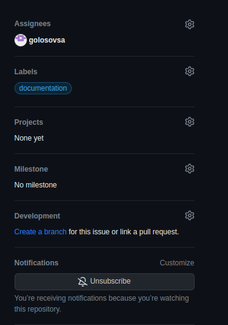
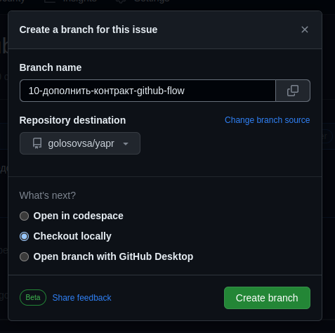
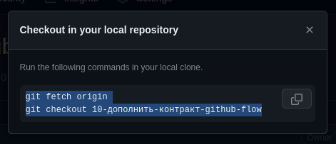

[назад](./tasks.md)


# GitHub-flow

Открываем свою задачу (issue), находим настройки (на десктопной версии - левая панель)



Нажимаем на ссылку - кнопку `Create a branch`



Нажимаем кнопку `Create branch`



Копируем код.


## Первый шаг

Если у Вас уже есть локальный репозиторий, переходим к шагу 2

Копируем репозиторий командой
```shell
git clone <url>
```

## Второй шаг

> В каждом репозитории запрещен пуш в ветку origin main


### Выполняем команды, скопированные в github
```shell
git fetch origin
git checkout 10-дополнить-контракт-github-flow
```


### Выполняем задачу

Не забываем делать коммиты
> Даже если сделано больше чем вписывается в одно изменение, 
> старайтесь коммитить изменения разбивая их на логические части
>> Добавил логгер, внедрение зависимостей, добавил модели данных
>>> Имя коммита 2-3 слова 


### Заливаем прошедшие изменения ветки origin main
```shell
git pull origin main
```


### Сливаем изменения ветки main со своей веткой
```shell
git merge main
```


### Решаем конфликты слияния (если они есть)

...


### Все проверяем локально

...


### Заливаем свою ветку в origin
```shell
git push origin 10-дополнить-контракт-github-flow
```

> Если на этом этапе возникла проблема
>> `git push --set-upstream-origin 10-дополнить-контракт-github-flow`
>>> Все следующие пуши можно будет делать 1 способом


## Третий шаг

Открываем страницу репозитория, github увидит новую ветку и предложит нам сделать pull-request. Создаем pull-request, нажав на кнопку `compare & pull-request`


## Четвертый шаг.

Если ревьювер оставит замечание и отклонит pull-request, продолжаем с `шага 3 -> выполняем задачу`
Если задача принята, то ревьювер закроет pull-request и удалит ветку.

## Пятый шаг

В случае успеха, github сам закроет задачу
